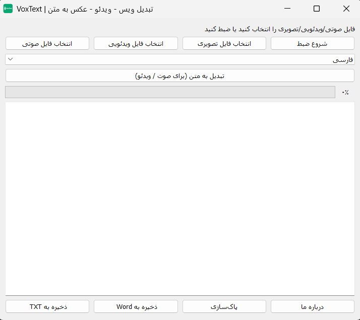

# VoxText 🎙️📝

اپلیکیشن **VoxText**   

### ✨ قابلیت‌ها
- 🎤 ضبط مستقیم صدا داخل برنامه و تبدیل آن به متن  
- 📷 آپلود عکس و استخراج متن (OCR)  
- 🎧 آپلود فایل صوتی و تبدیل به متن  
- 🎬 آپلود ویدئو و استخراج متن از صدا  
- 💾 ذخیرهٔ خروجی‌ها به صورت **Word (.docx)** و **Text (.txt)**  
- 📦 نصب آفلاین؛ بدون نیاز به دانلود پس از نصب  
- 🈂️ پشتیبانی کامل از **فارسی و انگلیسی** (تشخیص و تبدیل در هر دو زبان)

---

### 📥 دانلود مستقیم
[⬇️ دانلود VoxText Setup](https://github.com/farbodtf/VoxText/releases/download/v1.0.0/VoxText-Setup-1.0.0.exe)

---

 ### نکات نصب و اجرا ℹ️

- دانلود کنید📥 دانلود فایل نصب
- نصب و اجرا کنید و از شورت‌کات دسکتاپ استفاده کنید
- برای تست سریع، یک فایل صوتی کوتاه یا تصویر شامل متن فارسی/انگلیسی را وارد کنید تا خروجی را بررسی کنید.
- ⭐ اگر این پروژه برایتان مفید بود، خوشحال می‌شوم با Star کردن پروژه از توسعه آن حمایت کنید.

  

